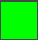
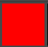
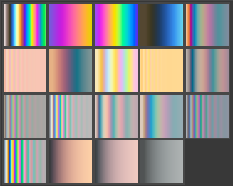

# Physically-based Gradients

A repository for Krita gradients that are based on thin film interference effects (soap bubble). Download from [here](https://github.com/rjmoerland/physically-based-gradients/releases/download/v1.2/Interference_Gradients.bundle).

## A note on color profiles

After releasing this set of gradients, it was found that on at least MacOS, the color profile used for these gradients cannot be found even though it is supplied with Krita (see discussion on [krita-artists.org](https://krita-artists.org/t/interference-based-gradients/102328/5)). As a fallback, the gradients also contain an embedded sRGB version, that will be used instead. As this may lead to some loss of quality, and also to ensure that Krita is doing the right thing on your system, there is a 'coal mine canary' gradient  in this repo that will be bright green if the profile is found, but bright red if the sRGB profile is used. You can test your Krita installation by importing [this gradient](https://github.com/rjmoerland/physically-based-gradients/raw/refs/heads/main/test_gradient/canary.svg) and checking the resulting color of the thumbnail. Feedback in the linked discussion would be welcome!

- Color profile is found successfully:

- Color profile not found:

## Contents

Visual representation:

The list below gives the gradients contained in this repository, with the sources of the material constants that created them. In all cases, the incident medium is air, approximated by n = 1.0. The materials are listed as base layer first, thin film second, optional third medium, air final.

- Car Paint (Zoom 1, 2, 3)
    - Aluminium [7], MgF approximated by n = 1.37, Chromium [3]
- Copper with Oxide
    - Copper [1], Copper oxide [2], simplified by linearly interpolating Fig. 8.
- Copper with water
    - Copper [1], Water approximated by n = 1.33
- Germanium on Gold
    - Gold [1], Germanium [6]
- Gold Film
    - Aluminium [7], MgF approximated by n = 1.37, Gold [1] 
- Gold with water
    - Gold [1], Water approximated by n = 1.33
- Heated Iron
    - Iron [3], Iron oxide [4]
- Iron with Oil
    - Iron [3], Oil approximated by n = 1.6
- Oil spill
    - Water approximated by n = 1.33, Oil approximated by n = 1.6
- Oxide 1
    - Aluminium [7], Iron Oxide [4], Chromium [3]
- Oxide 2
    - Aluminium [7], Copper oxide [2], Chromium [3]
- Silicon with Silicon Oxide
    - Silicon Oxide approximated by n = 1.46, Silicon [5]
- Soap Bubble
    - Air approximated by n = 1.0, Soapy water approximated by n = 1.4
- Space helmet
    - Plastic approximated by n = 1.5, Gold [1]
- Thin Copper
    - Plastic approximated by n = 1.5, Copper [1]
- Thin Iron
    - Plastic approximated by n = 1.5, Iron [3]

## Approach

The colors in the gradient are calculated by using the wave theory of light. The model takes a a base material, a thin layer on top of that and then a final medium. For example, a soap bubble has air as a base material (the inside of the bubble), a thin layer of soapy water, and then air as the final medium (the outside of the bubble). For a single wavelength (think color), incoming light can be partially or fully reflected depending on the thickness of the layer. For white light, this gives rise to a colorful reflection, as some colors are fully transmitted and others are fully reflected. 

These gradients were calculated assuming a white light spectrum that is decribed by the CIE D50 standard illuminant, normally incident onto the base layer. For a certain layer thickness, the spectrum was sampled with 80 points (wavelengths). Then, from the resultant reflectance spectra, the CIE X, Y and Z chromaticities were calculated and converted to the ACEScg-elle-V4-g10 color space. This process yields a single color per layer thickness. This process was then repeated for 3000 layer thicknesses, giving 3000 color shades to make up a gradient.

Since gradients with 3000 stops are not very efficient, a subsequent post-processing step set out to eliminate as many stops as possible without sacrificing visual fidelity. In order to do so, the color at every other stop was compared to the color obtained by linear interpolation in the ACEScg color space. If the color difference (delta E) was less than 0.5 (and sometimes less than 0.1), the stop was removed in favor of linear interpolation. This process was repeated until no more stops could be removed without sacrificing visual fidelty.

# References

1. [P. B. Johnson and R. W. Christy, Phys. Rev. B 6, 4370-4379 (1972)](https://doi.org/10.1103/PhysRevB.6.4370) via https://refractiveindex.info
2. [Wieder, H., & Czanderna, A. W. (1966), Journal of Applied Physics, 37(1), 184–187](https://doi.org/10.1063/1.1707803)
3. [P. B. Johnson and R. W. Christy, Phys. Rev. B 9, 5056-5070 (1974)](https://doi.org/10.1103/PhysRevB.9.5056) via https://refractiveindex.info
4. [M. R. Querry, Contractor Report CRDC-CR-85034 (1985)](https://apps.dtic.mil/sti/citations/ADA158623) via https://refractiveindex.info
5. [D. E. Aspnes and A. A. Studna, Phys. Rev. B 27, 985-1009 (1983)](https://doi.org/10.1103/PhysRevB.27.985) via https://refractiveindex.info
6. [G.E. Jellison Jr., Opt. Mat. 1, 151-160 (1992)](https://doi.org/10.1016/0925-3467(92)90022-F) via https://refractiveindex.info
7. [A. D. Rakić, Appl. Opt. 34, 4755-4767 (1995)](https://doi.org/10.1364/AO.34.004755) via https://refractiveindex.info
